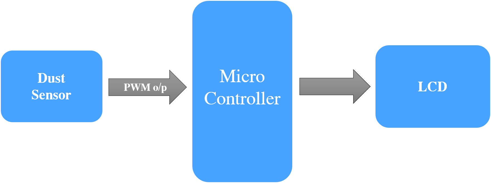
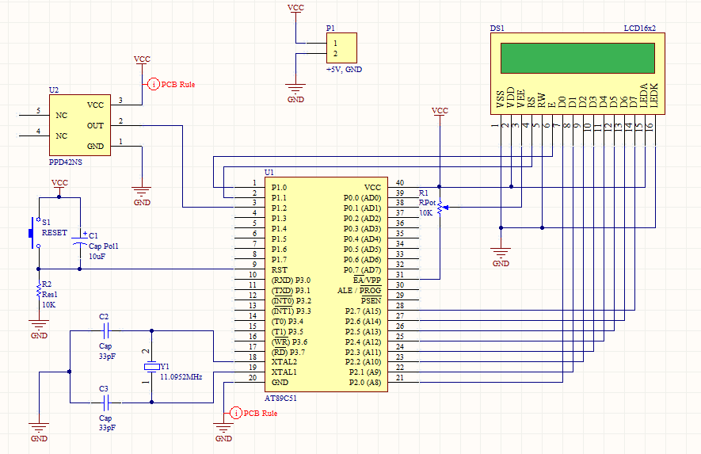
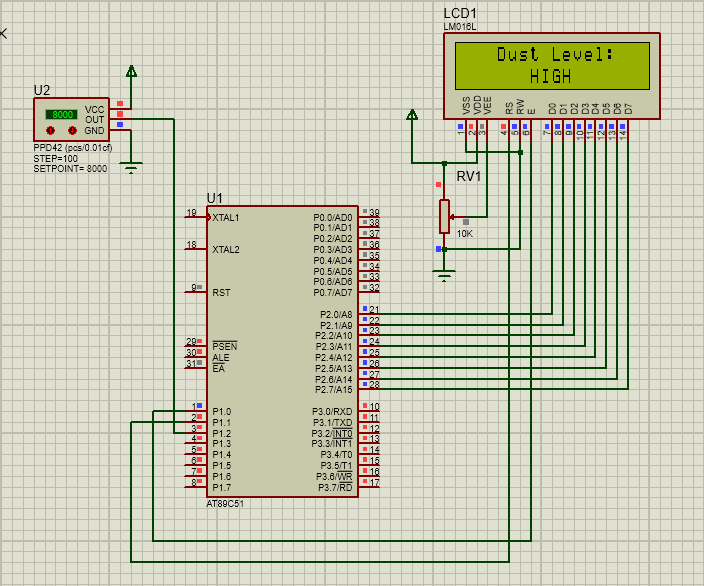
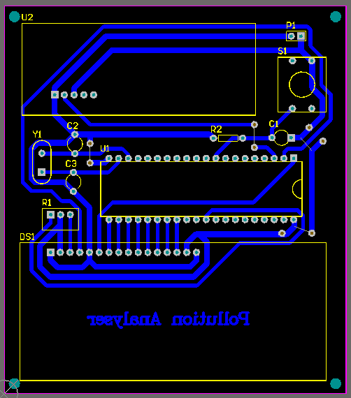

# Pollution-Analyser

This is a simple embedded system design for detecting dust level in the air using 8051.
The system continously monitors the dust level concenteration and updates the level of dust concenteration every 10 seconds (i.e. sample time).

### Components Used:

  - AT89C51
  - PPD42NS (Dust Sensor)
  - LCD (16x2)

### Block Diagram:

### Working:

  - Input Side:
  	- PPD42NS Dust sensor provides a negative pulse corresponding to the level of concenteration.

  - Output Side:
	- LCD (16x2) is used to display the output level, HIGH,MEDIUM and LOW.
	
  - The timer0 is used to create a time delay for 10 seconds, and the timer1 is used to measure the low pulse occupancy time of the output signal of the PPD4NS sensor. Every 10 seconds, the LPO resets.

### Schematic:

### Simulation:

      

### Design Constraint:

  - Have to use single sided PCB.
  - Hole size should be 1mm in diameter.

### PCB Layout:

The schematic and pcb layout is drawn using Altium Designer.
